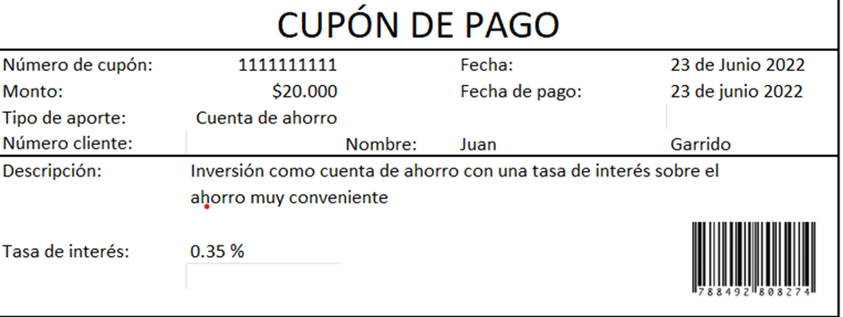
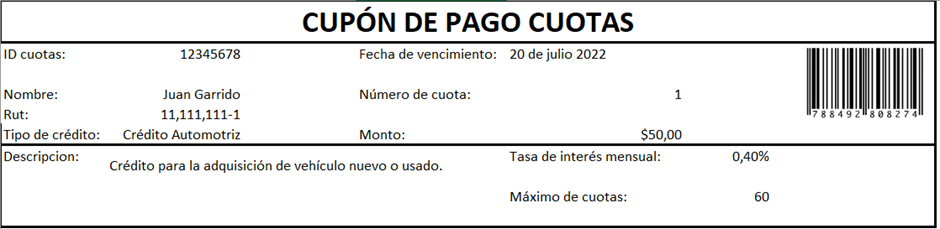
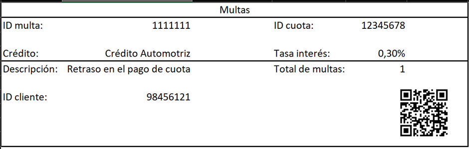
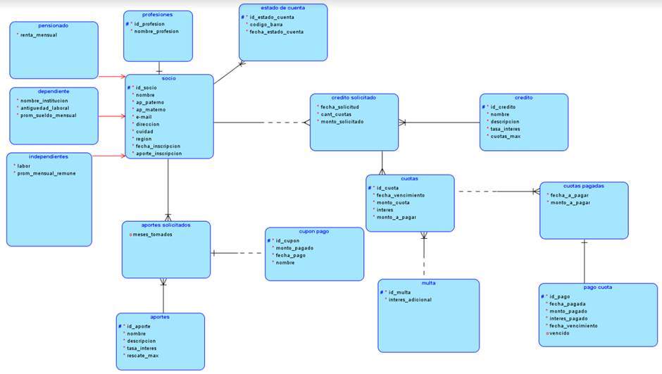

# Informe Entregable 1
## Propuesta modelo Entidad-Relación

Integrantes:
- Nicolás Sepulveda
- Vicente Paredes
- Paulina Candia
- Martin Valenzuela
- Claudia Gómez
- Maickol Reyes

### 1. Introducción

En el siguiente informe, presentaremos nuestros análisis respectivos al caso de la cooperativa coopera, el análisis que se llevó a cabo, dio como resultado, el modelo relacional que propondremos en este informe, este modelo fue realizado de acorde a las reglas de negocios previamente señaladas por Alejandro Montenegro, gerente general de coopera.

Para poder integrar de buena manera las nuevas vistas de negocio solicitadas, como equipo tomamos la decisión de agregar nuevas reglas de negocio que permitieron dar una visión más clara a las relaciones entre las entidades existentes y las nuevas entidades, estas nuevas reglas de negocio se encuentran detalladas en este informe.

En el presente documento, también se podrá encontrar la vista de negocio propuesta por nuestro equipo, para los cupones de pago, y multas

Para este análisis, además de los datos entregados por el gerente, se tomó en cuenta datos desde la vista de un estado de cuenta que se nos entregó.

### 2. Nuevas Reglas de negocio
Propuestas de nuevas reglas de negocios para multas:
-No exceder 3 multas en total. 
Este punto hace referencia a que cada cliente no puede poseer más de 3 multas, si esto ocurre el cliente no podrá tomar ningún otro crédito sin importar el tipo hasta que liquide las deudas.

-Monto de la multa dependerá del tipo de clientes; si se atrasa en el pago se le suman intereses a las siguientes cuotas, en un rango de 0.8%-0.2%
En este punto acordamos que debido a que cada cliente tiene realidades distintas se les tratara de manera distinta teniendo tasa de interés flexible para que todos tenga la posibilidad de pagar las cuotas que debe  

Propuestas de nuevas reglas de negocios para los cupones:
-Solo se puede pagar una cuota, solo debe contar con un solo cupón de pago
En este punto dejamos en claro que solo se puede pagar en una cuota por cada cupón de pago emitido por ende un cupon de pago no puede tener dos cuotas en su interior 
-Una vez usado el cupón de, este no se puede reutilizar.
En esto nos referimos a que una vez emitido el cupón de pago no puede existir otro cupón con un identificador igual al emitido, ya sea para otra cuota o otro crédito.

-El monto de un cupón de pago es igual al monto de la cuota.
Esto es que el monto por el cual se genera el cupon de pago debe de ser siempre el total de la cuota, por ende una cuota no puede tener mas de un cupon de pago

-Posee una fecha de vencimiento.
En esta regla nos enfocamos en que el cupon de pago debe de ser cancelado antes de su fecha de expiración sino comenzará aplicarse multa por el no pago.

### 3. Vistas de negocio
- Cupón de pago

- Multas

### 4. Modelo Entidad-Relación en Datamodeler
En el siguiente modelo, presentamos las entidades que reconocimos a partir del análisis del caso, y de la vista del estado de cuenta, con estas entidades pensamos se abarcan todas las que se relacionan en este negocio.

Reconocemos SOCIOS(PENSIONADOS-DEPENDIENTES-INDEPENDIENTES) ya que la cooperativa diferencia entre tipo de socios.
ESTADO DE CUENTA que cuenta con código de barras dentro de sus atributos.
CRÉDITOS como una tabla ya entregada, a la cual asociamos CRÉDITO SOLICITADO-CUOTAS-CUOTAS PAGADAS, siendo cuotas todas las cuotas que se generan, según el caso.
También usamos la tabla entregada APORTES que se relacionan APORTE SOLICITADO y un cupon de pago que aporta el dinero a la inversión.

En cuanto a las cuotas estas pueden tener multas y/o tener asociada un boleta de pago, ya que todas las cuotas están generadas, pero no todas las existentes deben estar pagadas como también pueden haber algunas con multa por no pago.

### 5. Conclusión

A partir de este informe, se pudo concluir el modelo Entidad-relación que proponemos como equipo para la solución del caso de la cooperativa coopera.

También propusimos vistas de negocios para los temas solicitados, Multas y cupones de pago consistentes con las reglas de negocio anteriormente señaladas.

Como equipo buscamos las mejores soluciones para modelar este diseño y hacerlo lo mas eficiente y menos redundante posible.
